# 🧠 Customer Churn Prediction & Decision Intelligence Platform

> **Enterprise-grade full-stack platform for customer churn analytics, explainability, time-to-churn estimation, uplift modeling, budget optimization, and model governance.**

[](https://fastapi.tiangolo.com/)
[](https://react.dev/)
[](https://vitejs.dev/)
[](https://python.org/)
[](https://xgboost.readthedocs.io/)
[](https://shap.readthedocs.io/)
[](./LICENSE)

<p align="center">
  
</p>
<p align="center"><em>Retention Command Center — the executive overview dashboard</em></p>

---

## 📋 Table of Contents

- [Project Overview](#-project-overview)
- [Purpose](#-purpose)
- [Business Goal](#-business-goal)
- [Technical Goal](#-technical-goal)
- [Features](#-features)
- [Technology Stack](#-technology-stack)
- [System Architecture](#-system-architecture)
- [Complete Project Structure](#-complete-project-structure)
- [Folder and File Explanation](#-folder-and-file-explanation)
- [Frontend Architecture](#-frontend-architecture)
- [Backend Architecture](#-backend-architecture)
- [API Documentation](#-api-documentation)
- [Database Design](#-database-design)
- [Request Flow](#-request-flow)
- [Authentication Flow](#-authentication-flow)
- [Data Flow](#-data-flow)
- [Installation](#-installation)
- [Environment Variables](#-environment-variables)
- [Local Development](#-local-development)
- [Build Process](#-build-process)
- [Deployment](#-deployment)
- [Security](#-security)
- [Error Handling](#-error-handling)
- [Logging](#-logging)
- [Performance Optimization](#-performance-optimization)
- [Testing](#-testing)
- [Future Improvements](#-future-improvements)
- [Contributing](#-contributing)
- [License](#-license)
- [Author](#-author)
- [Acknowledgements](#-acknowledgements)
- [Conclusion](#-conclusion)

---

## 📌 Project Overview

This repository implements a **Customer Churn Prediction and Decision Intelligence Platform** — a full-stack solution that combines a modern React single-page dashboard with a FastAPI machine-learning backend. Together they deliver end-to-end churn analytics: from raw data ingestion and preprocessing, through model scoring and explainability, all the way to executive reporting and model governance.

| System | Location | Responsibility |
|---|---|---|
| **Frontend Dashboard** | `churn-dashboard/` | React 19 / Vite 7 SPA used by analysts, executives, and administrators to interact with all platform capabilities. |
| **Backend API & ML Services** | `backend/` | FastAPI application hosting ingestion pipelines, ML models, explainability services, report generation, budget optimization, governance, and API endpoints. |

The repository also ships with local datasets, trained model artifacts (`.pkl`), uploaded files, cached inference results, generated PDF reports, and local dependency/runtime directories.

---

## 🎯 Purpose

The platform empowers retention, analytics, and executive teams to answer high-value operational questions:

- **Which customers are most likely to churn?**
- **Why is a customer at risk?** (SHAP + LLM explanations)
- **How soon is churn expected?** (Survival / time-to-churn modelling)
- **Which retention action will produce the best uplift?** (Uplift modelling)
- **How should a limited retention budget be allocated?** (Budget optimisation engine)
- **Which segments, plans, or risk drivers deserve immediate attention?** (Executive insights)
- **Is the model drifting, unfair, or losing confidence?** (Governance & monitoring)

---

## 💼 Business Goal

Reduce customer churn and protect recurring revenue by turning raw customer and churn-label data into **actionable retention decisions**. The system is designed to move beyond raw prediction into **intervention**: it recommends retention actions, ranks urgent customers, estimates recoverable revenue, and provides leadership with executive-level narrative summaries and PDF reports.

---

## ⚙️ Technical Goal

Deliver a modular, extensible, full-stack decision-intelligence platform with:

- A **React SPA** for interactive, visual analytics
- A **FastAPI** backend for all ML computation and data management
- **Reusable Python service modules** decoupled from routing concerns
- **Persisted `joblib` model artifacts** for churn, survival, and uplift models
- **File-based analytical storage** (CSV, Parquet, JSON, PDF) for datasets, caches, logs, and reports
- Extensible ingestion supporting **CSV, Excel, JSON, SQLite, PostgreSQL, MySQL, and MongoDB**

---

## ✨ Features

| Feature Area | Capabilities |
|---|---|
| **Data Ingestion** | Upload customer/churn files, generate synthetic datasets, preview and profile datasets, process raw data through the full pipeline. |
| **Dataset Overview** | Summary cards, histograms, segment counts, drilldowns, data quality reports, numeric binning. |
| **Churn Prediction** | Batch file scoring and single-customer scoring using persisted churn models. |
| **Explainability** | SHAP-style local explanations, global feature importance, LLM-generated explanations, action simulation. |
| **Time to Churn** | Survival/time-risk prediction, urgency scoring, urgent customer ranking. |
| **Uplift Modelling** | Uplift training, prediction, decile lift, Qini/gain metrics, policy comparison, counterfactual action evaluation. |
| **Retention Actions** | Decision plans, urgent action recommendations, action-mix visualisation. |
| **Budget Optimisation** | ROI-aware decision ranking, budget-constrained selection, CSV export. |
| **Executive Insights** | Revenue-at-risk, recoverable revenue, patterns, opportunities, segment intelligence, narrative reporting. |
| **Governance** | Drift detection, CUSUM monitoring, fairness summary, confidence scoring, governance logs. |
| **Reporting** | PDF executive reports generated from backend results. |
| **Frontend Routing** | Public home/login routes and protected dashboard routes with client-side guards. |

---

## 🛠️ Technology Stack

### Frontend

| Technology | Version | Use |
|---|---|---|
| **React** | 19 | UI component model and reactive rendering. |
| **Vite** | 7 | Fast development server and optimised production builds. |
| **React Router DOM** | 7 | Client-side single-page routing. |
| **TanStack React Query** | Latest | Server-state fetching, caching, background refetch. |
| **Zustand** | Latest | Lightweight, unopinionated client-side state stores. |
| **Axios / fetch** | — | HTTP API communication with the FastAPI backend. |
| **Recharts** | Latest | Composable charts for dashboards and analytics. |
| **Lucide React** | Latest | Clean SVG icon library. |
| **ESLint** | Latest | JavaScript and React code quality linting. |

### Backend

| Technology | Version | Use |
|---|---|---|
| **FastAPI** | Latest | Async HTTP API framework with automatic OpenAPI documentation. |
| **Uvicorn** | Latest | ASGI server for FastAPI. |
| **Pandas / NumPy / PyArrow** | Latest | Data loading, transformation, CSV/Parquet workflows. |
| **Scikit-learn** | Latest | Preprocessing pipelines, classifiers, evaluation metrics. |
| **XGBoost** | Latest | Gradient-boosted tree models for churn prediction and uplift. |
| **Lifelines** | Latest | Survival analysis and time-to-event modelling. |
| **SHAP** | Latest | Model explainability: local and global feature importance. |
| **Joblib** | Latest | Model serialisation and deserialisation. |
| **Groq SDK** | Latest | LLM API for explanation narration and retention strategy generation. |
| **ReportLab** | Latest | Programmatic PDF executive report generation. |
| **SQLAlchemy / psycopg2 / PyMySQL / PyMongo** | Latest | Database connector support for external ingestion sources. |
| **River** | Latest | Online/streaming drift and statistical monitoring. |
| **PyYAML** | Latest | Ingestion configuration and schema mapping files. |

---

## 🏗️ System Architecture

### High-Level Architecture

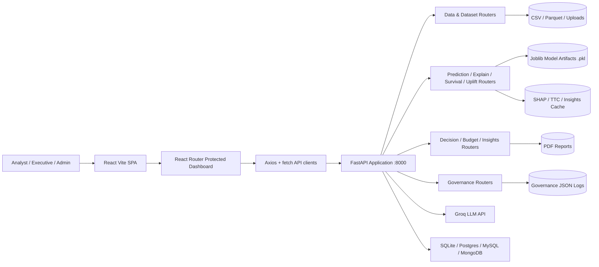

### Internal Module Architecture

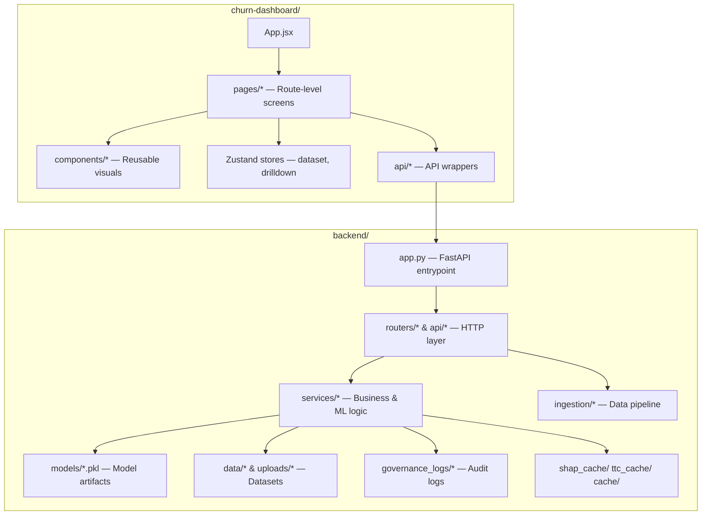

---

## 📁 Complete Project Structure

> **Repository Scan Summary**

| Category | Count / Note |
|---|---|
| Total files discovered (including generated/vendor/runtime) | ~35,222 |
| Application / source / config / data artifacts documented below | ~348 |
| Large generated directories | `.git/`, `churn-dashboard/node_modules/`, `backend/venv/`, `**/__pycache__/` |

```text
Customer-churn-prediction-main/
│
├── .gitattributes
├── README.md
├── cmdcmmtns.txt
├── discription.txt
├── summary.txt
├── system achetrure.png
│
├── .vscode/
│   └── settings.json
│
├── backend/
│   ├── .env
│   ├── .gitignore
│   ├── app.py
│   ├── config.py
│   ├── debug_schema.py
│   ├── file_utils.py
│   ├── package-lock.json
│   ├── package.json
│   ├── requirements.txt
│   ├── test.py
│   ├── test_pipeline.py
│   ├── train_uplift_model.py
│   ├── uplift_feature_adapter.py
│   ├── uplift_policy_validation_api.py
│   ├── uplift_smoke.py
│   │
│   ├── api/
│   │   ├── data_sources.py
│   │   ├── ingestion_routers.py
│   │   ├── insights_routers.py
│   │   ├── optimizer_routes.py
│   │   └── uplift_routes.py
│   │
│   ├── cache/
│   │   └── insights/
│   │       ├── 563f34a8f9081096d8f89c703e0905a1.json
│   │       ├── 78a67a1a9a3ad55f77ebdc4f14c27cf5.json
│   │       ├── 7953bd421277d29d869f7a65ef1cfcf6.json
│   │       └── 99d99a31278d68aa996043cdb0c33e46.json
│   │
│   ├── counterfactual/
│   │   ├── model_store.py
│   │   └── outcome_model.py
│   │
│   ├── data/
│   │   ├── churn_file.csv
│   │   ├── customer_file.csv
│   │   ├── dataset_registry.json
│   │   ├── scoring_results.json
│   │   ├── processed/
│   │   │   ├── WA_Fn-UseC_-Telco-Customer-Churn.csv
│   │   │   ├── dataset_20260302_152535.parquet
│   │   │   ├── dataset_20260302_153450.parquet
│   │   │   ├── dataset_20260302_153555.parquet
│   │   │   ├── dataset_20260302_154416.parquet
│   │   │   ├── processed_synthetic_12000.csv
│   │   │   ├── processed_teleco_25000.csv
│   │   │   ├── processed_teleco_6000.csv
│   │   │   ├── processed_teleco_8000.csv
│   │   │   └── teleco_5000.csv
│   │   └── raw/
│   │       ├── WA_Fn-UseC_-Telco-Customer-Churn.csv
│   │       ├── churn_file.csv
│   │       ├── processed_synthetic_12000.csv
│   │       ├── processed_synthetic_25000.csv
│   │       ├── processed_synthetic_5000.csv
│   │       ├── processed_synthetic_6000.csv
│   │       ├── processed_synthetic_8000.csv
│   │       ├── processed_teleco_12000.csv
│   │       ├── processed_teleco_6000.csv
│   │       ├── synthetic_12000.csv
│   │       ├── synthetic_25000.csv
│   │       ├── synthetic_5000.csv
│   │       ├── synthetic_6000.csv
│   │       └── synthetic_8000.csv
│   │
│   ├── governance_logs/
│   │   ├── processed_synthetic_5000_20260323_151348.json
│   │   ├── processed_synthetic_5000_20260323_151453.json
│   │   ├── processed_synthetic_5000_20260324_045624.json
│   │   └── ... (31 timestamped governance log files total)
│   │
│   ├── ingestion/
│   │   ├── pipeline.py
│   │   ├── service.py
│   │   ├── config/
│   │   │   ├── column_mapping.yaml
│   │   │   ├── feature_schema.yaml
│   │   │   └── ingestion_settings.yaml
│   │   ├── connectors/
│   │   │   ├── __init__.py
│   │   │   ├── base_connector.py
│   │   │   ├── mongodb_connector.py
│   │   │   ├── mysql_connector.py
│   │   │   ├── postgres_connector.py
│   │   │   └── sqlite_connector.py
│   │   ├── mapping/
│   │   │   ├── __init__.py
│   │   │   └── schema_mapper.py
│   │   ├── processing/
│   │   │   ├── __init__.py
│   │   │   ├── cleaning.py
│   │   │   ├── encoding.py
│   │   │   ├── feature_engineering.py
│   │   │   └── normalization.py
│   │   ├── profiling/
│   │   │   └── schema_profiler.py
│   │   ├── readers/
│   │   │   ├── __init__.py
│   │   │   ├── csv_reader.py
│   │   │   ├── excel_reader.py
│   │   │   └── json_reader.py
│   │   ├── storage/
│   │   │   ├── __init__.py
│   │   │   └── dataset_registry.py
│   │   ├── utils/
│   │   │   ├── __init__.py
│   │   │   ├── helpers.py
│   │   │   └── logger.py
│   │   └── validation/
│   │       ├── __init__.py
│   │       └── validator.py
│   │
│   ├── insights/
│   │   ├── budget_efficiency.py
│   │   ├── data_loader.py
│   │   ├── executive_engine.py
│   │   ├── narrative_generator.py
│   │   ├── opportunity_detector.py
│   │   ├── pattern_detection.py
│   │   ├── revenue_impact.py
│   │   ├── risk_driver_analysis.py
│   │   └── segment_intelligence.py
│   │
│   ├── models/
│   │   ├── churn_model.pkl
│   │   ├── churn_model_colab.pkl
│   │   ├── feature_cols.pkl
│   │   ├── preprocess_pipeline.pkl
│   │   ├── shared_prep.pkl
│   │   ├── survival_model.pkl
│   │   └── uplift_model.pkl
│   │
│   ├── optimizer/
│   │   ├── budget_optimizer.py
│   │   ├── campaign_allocator.py
│   │   ├── greedy_allocator.py
│   │   ├── knapsack_solver.py
│   │   └── roi_calculator.py
│   │
│   ├── reports/
│   │   ├── executive_report_processed_synthetic_12000.csv.pdf
│   │   └── executive_report_processed_synthetic_5000.csv.pdf
│   │
│   ├── routers/
│   │   ├── budget_router.py
│   │   ├── dashboard_router.py
│   │   ├── data_router.py
│   │   ├── data_source_router.py
│   │   ├── dataset_overview_router.py
│   │   ├── decision_router.py
│   │   ├── explain_router.py
│   │   ├── governance.py
│   │   ├── insights.py
│   │   ├── llm_router.py
│   │   ├── model_router.py
│   │   ├── predict_router.py
│   │   ├── prep_router.py
│   │   ├── report_router.py
│   │   ├── simulator_router.py
│   │   ├── survival_router.py
│   │   ├── timetochurn_router.py
│   │   └── uplift_router.py
│   │
│   ├── schemas/
│   │   ├── dataset_overview_schema.py
│   │   └── governance_schemas.py
│   │
│   ├── scoring/
│   │   ├── churn_scoring.py
│   │   ├── insights_engine.py
│   │   ├── orchestrator.py
│   │   ├── ttc_scoring.py
│   │   └── uplift_scoring.py
│   │
│   ├── services/
│   │   ├── action_simulator.py
│   │   ├── budget_optimizer.py
│   │   ├── dataset_overview_service.py
│   │   ├── decision_engine.py
│   │   ├── explainer.py
│   │   ├── feature_engineering.py
│   │   ├── full_scoring.py
│   │   ├── governance.py
│   │   ├── insights_cache.py
│   │   ├── llm_explainer.py
│   │   ├── model_loader.py
│   │   ├── modeling.py
│   │   ├── predictor.py
│   │   ├── preprocessing.py
│   │   ├── profiling.py
│   │   ├── report_generator.py
│   │   ├── runtime_registry.py
│   │   ├── shap_cache.py
│   │   ├── shared_preprocessor.py
│   │   ├── survival_model.py
│   │   ├── synthetic_generator.py
│   │   ├── ttc_cache.py
│   │   └── uplift_model.py
│   │
│   ├── shap_cache/
│   │   └── d5df26f92971326805669e8ac06ab1ed_L50_K5.json
│   │
│   ├── simulator/
│   │   └── strategy_simulator.py
│   │
│   ├── storage/
│   │   └── results_store.py
│   │
│   ├── ttc_cache/
│   │   ├── 1d83a6d01c2dc777bbb214ee786ea64a.json
│   │   ├── 563f34a8f9081096d8f89c703e0905a1.json
│   │   ├── 78a67a1a9a3ad55f77ebdc4f14c27cf5.json
│   │   ├── 7953bd421277d29d869f7a65ef1cfcf6.json
│   │   ├── 7e94e4ec0d080575e8dd65a426693364.json
│   │   ├── 99d99a31278d68aa996043cdb0c33e46.json
│   │   ├── 9ed7e8f0c8ea179d8f55ef9d3d1e68fd.json
│   │   ├── b83ad5402c502a7988c1c94c8280776e.json
│   │   └── d5df26f92971326805669e8ac06ab1ed.json
│   │
│   ├── uplift/
│   │   ├── evaluation.py
│   │   ├── meta_learners.py
│   │   ├── s_learner.py
│   │   ├── t_learner.py
│   │   ├── treatment_encoder.py
│   │   ├── treatment_schema.py
│   │   ├── uplift_dataset_builder.py
│   │   ├── uplift_explainer.py
│   │   ├── uplift_predictor.py
│   │   ├── x_learner.py
│   │   └── validation/
│   │       ├── bootstrap_ci.py
│   │       ├── policies.py
│   │       ├── policy_evaluator.py
│   │       └── uplift_metrics.py
│   │
│   ├── uploads/
│   │   ├── churn_file.csv
│   │   ├── customer_file.csv
│   │   ├── dataset_009e4e3bb5c9478e96dddf08d11da32e.csv
│   │   ├── dataset_02ffb504d79d402799881477cdf42659.csv
│   │   ├── dataset_1286b9049295433c9321e48fec8d1ffa.csv
│   │   ├── dataset_1568540af19e4276a6024e30ac485c51.csv
│   │   ├── dataset_15f54e1b4951433d9f1bde9e6de09c73.csv
│   │   ├── dataset_1aef5e56106547e99925e06d8204dfed.csv
│   │   ├── dataset_1bdeb7e51dcb40ed8fa95b8877d1ec67.csv
│   │   ├── dataset_3c58f807964a47499e12d03dc887494f.csv
│   │   ├── dataset_3d92fd7d55fb46e484326332bf3737f9.csv
│   │   ├── dataset_508ee102f051443b96d0aeef0a22ea1f.csv
│   │   ├── dataset_53af6a08ada64cb1a3f841c02239c08b.csv
│   │   ├── dataset_54d642f0b1884cc09e5f05756e705723.csv
│   │   ├── dataset_554bd7551a324ba1b20d6d21218d2f2f.csv
│   │   ├── dataset_5ddf8e3ee7c0459db5e7c1a9e07792fa.csv
│   │   ├── dataset_600c8d69abb046e2a9d20dd2d29b5e77.csv
│   │   ├── dataset_64f84025e9ea44aa8557f405cc46cafc.csv
│   │   ├── dataset_66e00ccc7cc5407a869a920d8a4710d9.csv
│   │   ├── dataset_6a6dfe0f9df0457d9076d8accb308195.csv
│   │   ├── dataset_6de97310e62d40fcb688abbf729130f0.csv
│   │   ├── dataset_71282a9d03a342d8845ba8e8aabaf5af.csv
│   │   ├── dataset_7a0e8a22841740f7beba93a0e9610fb6.csv
│   │   ├── dataset_7b2fc3b1237341b8b86dece37c601c02.csv
│   │   ├── dataset_7b3ec65a731e41268e1552af2c662c99.csv
│   │   ├── dataset_7bc45304b15949ae86ba301cec88225e.csv
│   │   ├── dataset_8304dfd4209e454fb2342d477b947842.csv
│   │   ├── dataset_89f94f1b681b406581e5dcc7349574ec.csv
│   │   ├── dataset_9034f7d4cf2a42e98dc0ce54f56c11ec.csv
│   │   ├── dataset_95ef7932d5b744c785eca5038071e956.csv
│   │   ├── dataset_992e052b9de64a6abd0093122a461d70.csv
│   │   ├── dataset_a3bbcf304b074f168ab2246253545e58.csv
│   │   ├── dataset_a69c7c48d61141968f9e2ffb3d139367.csv
│   │   ├── dataset_badbac7bfdcb4d5cb86176222c568a7f.csv
│   │   ├── dataset_bcb90da625c54fde87f204dc6905fb3d.csv
│   │   ├── dataset_c4b9963c5d6a4b899cafb9ae2df6ad66.csv
│   │   ├── dataset_c50cb01c9faf4d4f9fad2aaea969fe45.csv
│   │   ├── dataset_d244c20798674651aeb846afe8cb2dbe.csv
│   │   ├── dataset_dbc3690add224290a5430270b070006b.csv
│   │   ├── dataset_e27ac632521f4550b59ec907a4e9190c.csv
│   │   ├── dataset_e9f2f390b14a453d881022e419855575.csv
│   │   ├── dataset_efb06f62b9684a3990396a406084de97.csv
│   │   ├── synthetic_0cbea427b3374534855696462d34902c.csv
│   │   ├── synthetic_3b9cc7efbff54b2aa86bf36e7b150741.csv
│   │   └── synthetic_5cfddb9946d3489fa809ec0d4b1dea14.csv
│   │
│   └── utils/
│       └── governance_logger.py
│
├── churn-dashboard/
│   ├── .gitignore
│   ├── README.md
│   ├── eslint.config.js
│   ├── index.html
│   ├── package-lock.json
│   ├── package.json
│   ├── vite.config.js
│   ├── public/
│   │   └── vite.svg
│   └── src/
│       ├── App.css
│       ├── App.jsx
│       ├── api.js
│       ├── index.css
│       ├── main.jsx
│       ├── styles.css
│       ├── api/
│       │   ├── datasetApi.js
│       │   ├── insights.js
│       │   ├── simulate.js
│       │   ├── ttcApi.js
│       │   └── upliftApi.js
│       ├── assets/
│       │   └── react.svg
│       ├── components/
│       │   ├── ActionMixChart.jsx
│       │   ├── ActionSimulator.jsx
│       │   ├── ConfidenceGauge.jsx
│       │   ├── DriftStatusRow.jsx
│       │   ├── DrilldownTable.jsx
│       │   ├── FairnessCard.jsx
│       │   ├── GlobalShapChart.jsx
│       │   ├── KpiCard.jsx
│       │   ├── ProtectedRoute.jsx
│       │   ├── ShapPanel.jsx
│       │   ├── Sidebar.jsx
│       │   ├── TopTargetsTable.jsx
│       │   ├── charts/
│       │   │   ├── ChurnPieChart.jsx
│       │   │   ├── HistogramChart.jsx
│       │   │   ├── PlanTypeBarChart.jsx
│       │   │   ├── ROIChart.jsx
│       │   │   ├── RiskHistogram.jsx
│       │   │   ├── RiskPie.jsx
│       │   │   ├── SegmentBarChart.jsx
│       │   │   ├── ShapBarChart.jsx
│       │   │   ├── ShapGlobalChart.jsx
│       │   │   └── ShapImportanceChart.jsx
│       │   ├── churn/
│       │   │   ├── RiskChart.jsx
│       │   │   ├── RiskTable.jsx
│       │   │   └── SegmentRiskChart.jsx
│       │   ├── dataset/
│       │   │   ├── QualityPanel.jsx
│       │   │   └── SummaryCardsRow.jsx
│       │   ├── simulate/
│       │   │   └── SimulatorPanel.jsx
│       │   ├── ttc/
│       │   │   ├── TtcPanel.jsx
│       │   │   ├── TtcTimelineChart.jsx
│       │   │   ├── TtcUpliftHeatmap.jsx
│       │   │   └── UrgentDecisionPanel.jsx
│       │   └── uplift/
│       │       ├── BudgetPanel.jsx
│       │       ├── DecileLiftTable.jsx
│       │       ├── ExplainPanel.jsx
│       │       ├── LLMPanel.jsx
│       │       ├── OptimizerPanel.jsx
│       │       ├── StrategyPanel.jsx
│       │       ├── UpliftBarChart.jsx
│       │       ├── UpliftEvaluationPanel.jsx
│       │       ├── UpliftExplainPanel.jsx
│       │       └── UpliftVectorPanel.jsx
│       ├── pages/
│       │   ├── AdminPanel.jsx
│       │   ├── BudgetOptimizer.jsx
│       │   ├── CampaignPlanner.jsx
│       │   ├── ChurnPrediction.jsx
│       │   ├── CommandCenter.jsx
│       │   ├── DashboardLayout.jsx
│       │   ├── DataSource.jsx
│       │   ├── DatasetOverview.jsx
│       │   ├── ExecutiveInsights.jsx
│       │   ├── ExperimentPage.jsx
│       │   ├── Explainability.jsx
│       │   ├── GovernancePage.jsx
│       │   ├── Home.jsx
│       │   ├── Login.jsx
│       │   ├── RetentionDashboard.jsx
│       │   ├── RiskDistribution.jsx
│       │   ├── ShapDashboard.jsx
│       │   ├── TimeToChurn.jsx
│       │   ├── TtcCommandCenter.jsx
│       │   ├── UpliftActions.jsx
│       │   ├── UpliftDashboard.jsx
│       │   └── UpliftPage.jsx
│       ├── store/
│       │   ├── datasetStore.js
│       │   └── drilldownStore.js
│       └── utils/
│           ├── getFilename.js
│           └── sampleCustomer.js
│
└── [generated-and-runtime-directories]
    ├── .git/                          Git metadata and object database (generated by Git)
    ├── backend/venv/                  Python virtual environment (third-party packages)
    ├── backend/**/__pycache__/        Python bytecode caches (generated at runtime)
    └── churn-dashboard/node_modules/  JavaScript dependencies (third-party package tree)
```

---

## 📂 Folder and File Explanation

### Root Level

| Path | Purpose & Interaction |
|---|---|
| `README.md` | Primary repository documentation — architecture, API surface, setup, and operational guidance. |
| `.gitattributes` | Git line-ending and diff attribute configuration for cross-platform consistency. |
| `.vscode/settings.json` | Workspace-specific VS Code editor settings for local development uniformity. |
| `cmdcmmtns.txt` | Developer command/comment notes retained with the project. Not imported by runtime code. |
| `discription.txt` | Project description notes file. Not imported by frontend or backend. |
| `summary.txt` | Large textual summary artifact. Not used by the runtime. |
| `system achetrure.png` | Architecture diagram image artifact. Mermaid diagrams in this README provide a text-native equivalent. |

---

### Backend — Root Files

| File | Purpose & Interaction |
|---|---|
| `app.py` | **FastAPI application entrypoint.** Loads environment variables, enables CORS (`allow_origins=["*"]`), instantiates the FastAPI app, registers every router, and exposes `GET /` health-check. This is the single file Uvicorn is pointed at. |
| `config.py` | Defines `BASE_DIR`, `RAW_DATA_DIR`, and `PROCESSED_DATA_DIR` path constants and ensures those directories exist on startup. Imported by routers and services to resolve consistent data paths. |
| `requirements.txt` | Python dependency manifest. Contains all production packages; use with `pip install -r requirements.txt`. |
| `.env` | Local environment secrets file. Contains `GROQ_API_KEY`. **Must never be committed to source control or shared.** Rotate credentials if exposed. |
| `debug_schema.py` | Developer utility for inspecting data schemas and debugging column-mapping issues. Not used in production routing. |
| `file_utils.py` | Helpers for file-path construction and safe file-existence checks shared across routers and services. |
| `test.py` | Backend test/smoke helper for validating basic backend functionality locally. |
| `test_pipeline.py` | Pipeline validation helper — loads a file and runs the ingestion pipeline to verify correctness end-to-end. |
| `train_uplift_model.py` | Standalone script to train and serialise the uplift model artifact to `models/uplift_model.pkl`. Run offline; not called by the API at request time. |
| `uplift_feature_adapter.py` | Aligns feature columns between training and inference time for the uplift model to prevent shape mismatches. |
| `uplift_policy_validation_api.py` | Registers `/uplift/experiment/policy-compare/{filename}` to compare uplift intervention policies. Mounted into `app.py` as a sub-application or router. |
| `uplift_smoke.py` | Smoke-test script to validate the uplift model and prediction pipeline returns non-null results. |

---

### Backend — `api/`

| File | Purpose |
|---|---|
| `data_sources.py` | Registers external data-source routes (`/api/data-source/test`, `/ingest`, `/tables`, `/preview`). |
| `ingestion_routers.py` | Mounts the ingestion pipeline endpoint (`POST /ingest`). |
| `insights_routers.py` | Registers the `/insights/latest` route for retrieving the most recently cached insights. |
| `optimizer_routes.py` | Registers budget-optimiser API routes from the `optimizer/` module. |
| `uplift_routes.py` | Registers counterfactual (`POST /uplift/counterfactual`) and best-action (`POST /uplift/best-action`) uplift routes backed by the `counterfactual/` module. |

---

### Backend — `routers/`

Each router module forms one HTTP layer slice. Routers parse requests, delegate all ML/data logic to `services/`, and shape JSON responses.

| Router File | Prefix / Key Routes | Responsibility |
|---|---|---|
| `data_router.py` | `/data/*` | File generation, upload, profiling, processing, preview, two-file upload, synthetic generation, DB connection test. |
| `data_source_router.py` | `/data/*` | Serves as alternate data-source upload/processing routes alongside `data_router`. |
| `dataset_overview_router.py` | `/dataset/*` | Summary, quality, histogram, segments, drilldown, columns, and numeric-bins endpoints. |
| `predict_router.py` | `/predict/*` | Batch file scoring and single-customer JSON scoring. |
| `model_router.py` | `/model/*` | Model training trigger and model-level prediction. |
| `prep_router.py` | `/prep/*` | Trains/builds shared preprocessing pipeline. |
| `explain_router.py` | `/explain/*` | SHAP explanations (file, single, global) and action simulation. |
| `survival_router.py` | `/survival/*` | Survival model training and prediction. |
| `timetochurn_router.py` | `/timetochurn/*` | TTC summary, urgency scoring, urgent customer list. |
| `uplift_router.py` | `/uplift/*` | Uplift training, prediction, evaluation, deciles, actions, and policy comparison. |
| `decision_router.py` | `/decision/*` | Budget-aware decision plan and urgent customer recommendations. |
| `budget_router.py` | `/budget/*` | Budget optimisation for a dataset. |
| `llm_router.py` | `/llm/*` | LLM-generated decision explanations via Groq API. |
| `report_router.py` | `/report/*` | Executive PDF report generation and download. |
| `governance.py` | `/api/governance/*` | Governance analysis, report retrieval, drift status, confidence history, fairness summary. |
| `insights.py` | `/insights/*` | Executive insights computation endpoint. |
| `dashboard_router.py` | `/dashboard/*` | Command-centre KPI and trend aggregation. |
| `simulator_router.py` | `/simulate/*` | Action simulation through the strategy simulator. |

---

### Backend — `services/`

The business logic and ML orchestration layer. All computation lives here; routers are thin wrappers.

| Service File | Responsibility |
|---|---|
| `model_loader.py` | Lazy-loads and caches `churn_model.pkl`, `feature_cols.pkl`, `preprocess_pipeline.pkl`, `shared_prep.pkl`, `survival_model.pkl`, and `uplift_model.pkl`. |
| `preprocessing.py` | Applies the stored preprocessing pipeline to raw feature DataFrames before scoring. |
| `shared_preprocessor.py` | Provides a unified preprocessing interface reused by both churn and uplift scoring paths. |
| `feature_engineering.py` | Derives additional features from raw customer columns (tenure binning, ratio features, etc.). |
| `predictor.py` | Runs the churn model, returns per-row churn probability and binary prediction. |
| `full_scoring.py` | Orchestrates the end-to-end scoring pipeline: load CSV → preprocess → predict → return enriched DataFrame. |
| `explainer.py` | Computes SHAP values, sorts by risk, returns top-K local explanations; writes results to `shap_cache/`. |
| `llm_explainer.py` | Calls Groq's LLM API with customer risk context and returns narrative explanation and recommended retention action. |
| `survival_model.py` | Fits and applies the survival/time-to-event model (Lifelines); estimates time-to-churn per customer. |
| `uplift_model.py` | Wraps the `uplift/` framework's meta-learners for training and scoring uplift values. |
| `decision_engine.py` | Combines churn score, TTC urgency, uplift estimate, and action cost into a ranked, budget-constrained decision plan. |
| `budget_optimizer.py` | Budget-allocation logic: given a set of ranked customers and actions, selects an optimal subset within a budget ceiling using knapsack/greedy approaches. |
| `action_simulator.py` | Simulates "what-if" feature changes and re-scores a customer to estimate the churn-probability delta for a proposed intervention. |
| `dataset_overview_service.py` | Computes summary statistics, quality metrics, histograms, segment distributions, and drilldown slices from processed datasets. |
| `governance.py` | Runs drift detection (CUSUM), fairness analysis (demographic parity, equal opportunity), and confidence scoring; persists result to `governance_logs/`. |
| `insights_cache.py` | Reads/writes computed executive insights to `cache/insights/` keyed by dataset hash. |
| `shap_cache.py` | Reads/writes SHAP explanation results to `shap_cache/` keyed by dataset hash + limit + top-K. |
| `ttc_cache.py` | Reads/writes TTC summaries to `ttc_cache/` keyed by dataset hash. |
| `report_generator.py` | Uses ReportLab to build and write a multi-page executive PDF report to `reports/`. |
| `synthetic_generator.py` | Generates synthetic customer datasets with realistic distributions for demo and testing. |
| `modeling.py` | Model training utilities — fit, evaluate, and serialise new churn models. |
| `profiling.py` | Dataset-level statistical profiling used by the ingestion pipeline. |
| `runtime_registry.py` | In-memory registry tracking which datasets and models are currently loaded. |
| `results_store.py` | Persists scoring result payloads to `data/scoring_results.json`. |

---

### Backend — `ingestion/`

A fully standalone data ingestion subsystem.

| Module | Responsibility |
|---|---|
| `pipeline.py` | Orchestrates the full ingestion pipeline: read → validate → map → clean → encode → engineer → normalise → store. |
| `service.py` | FastAPI-facing ingestion service; exposes pipeline execution to the router layer. |
| `config/column_mapping.yaml` | Maps source column names to canonical internal names for heterogeneous data sources. |
| `config/feature_schema.yaml` | Declares expected features, types, and constraints for schema validation. |
| `config/ingestion_settings.yaml` | Global ingestion behaviour settings (batch size, encoding defaults, etc.). |
| `connectors/base_connector.py` | Abstract base class defining the connector interface (`connect`, `execute_query`, `close`). |
| `connectors/sqlite_connector.py` | Connects to SQLite databases and fetches query results as DataFrames. |
| `connectors/postgres_connector.py` | Connects to PostgreSQL via SQLAlchemy + psycopg2. |
| `connectors/mysql_connector.py` | Connects to MySQL via SQLAlchemy + PyMySQL. |
| `connectors/mongodb_connector.py` | Connects to MongoDB via PyMongo and converts documents to DataFrames. |
| `readers/csv_reader.py` | Reads CSV files into Pandas DataFrames with configurable encoding/delimiter handling. |
| `readers/excel_reader.py` | Reads `.xlsx`/`.xls` files via `pd.read_excel`. |
| `readers/json_reader.py` | Reads JSON files (records or list-of-dicts) into DataFrames. |
| `mapping/schema_mapper.py` | Applies `column_mapping.yaml` to rename and standardise columns from any source. |
| `processing/cleaning.py` | Drops duplicates, handles nulls, removes out-of-range values, and corrects type mismatches. |
| `processing/encoding.py` | Encodes categorical features (label encoding / one-hot) consistent with model training. |
| `processing/feature_engineering.py` | Derives additional features from cleaned data. |
| `processing/normalization.py` | Scales numeric features using min-max or standard-scaler logic. |
| `profiling/schema_profiler.py` | Produces a schema profile report (types, nulls, uniqueness, distributions) for validation and data quality. |
| `validation/validator.py` | Validates a DataFrame against `feature_schema.yaml`; raises structured errors on violations. |
| `storage/dataset_registry.py` | Appends processed dataset metadata to `data/dataset_registry.json`. |
| `utils/logger.py` | Configures the `ingestion` named Python logger. |
| `utils/helpers.py` | Shared utility functions used across ingestion sub-modules. |

---

### Backend — `insights/`

Executive insight computation modules, each covering one analytical dimension.

| File | Responsibility |
|---|---|
| `executive_engine.py` | Orchestrates all insight modules and returns a unified executive-insights payload. |
| `revenue_impact.py` | Computes revenue-at-risk and recoverable-revenue estimates from churn probabilities and CLV. |
| `risk_driver_analysis.py` | Identifies and ranks the top risk drivers across the customer base from SHAP global values. |
| `segment_intelligence.py` | Segments customers by plan, region, tenure, or other dimensions and computes per-segment churn rates and urgency. |
| `opportunity_detector.py` | Detects actionable retention opportunities (high-uplift + high-risk customers). |
| `pattern_detection.py` | Finds recurring churn patterns (e.g., short-tenure + high-spend) for strategic awareness. |
| `budget_efficiency.py` | Evaluates cost-efficiency of retention spend against projected churn recovery. |
| `narrative_generator.py` | Sends aggregated insights to the Groq LLM to generate a human-readable executive narrative. |
| `data_loader.py` | Loads and merges the processed dataset for insight computation. |

---

### Backend — `uplift/`

| File | Responsibility |
|---|---|
| `meta_learners.py` | Dispatcher selecting S-Learner, T-Learner, or X-Learner based on configuration. |
| `s_learner.py` | S-Learner implementation: trains a single model on treatment flag as a feature. |
| `t_learner.py` | T-Learner implementation: trains separate models for treatment and control groups. |
| `x_learner.py` | X-Learner implementation: uses cross-fitted residuals for more accurate uplift estimation. |
| `treatment_encoder.py` | Encodes multi-class treatment actions (e.g., discount, call, email) into numeric representations. |
| `treatment_schema.py` | Defines the canonical set of available retention actions and their cost/feature mappings. |
| `uplift_dataset_builder.py` | Constructs training datasets with treatment and control splits from a processed customer DataFrame. |
| `uplift_predictor.py` | Applies the trained uplift model to score customers; returns per-action uplift vectors. |
| `uplift_explainer.py` | Explains uplift predictions with action-level SHAP values. |
| `evaluation.py` | Computes Qini coefficient, gain curves, and decile lift tables for model evaluation. |
| `validation/bootstrap_ci.py` | Bootstrap confidence intervals for uplift metric estimates. |
| `validation/policies.py` | Defines rule-based and model-based intervention policies. |
| `validation/policy_evaluator.py` | Evaluates and compares policy outcomes (ROI, affected customers, expected recovery). |
| `validation/uplift_metrics.py` | Custom uplift evaluation metrics beyond standard classification metrics. |

<p align="center">
  
</p>
<p align="center"><em>Decile Lift Table — uplift model evaluation output</em></p>

---

### Backend — `optimizer/`

| File | Responsibility |
|---|---|
| `roi_calculator.py` | Estimates ROI per customer-action pair from uplift score, CLV, and action cost. |
| `greedy_allocator.py` | Greedy budget allocation: sorts by ROI descending and greedily assigns budget. |
| `knapsack_solver.py` | 0/1 knapsack optimisation for exact budget-constrained action selection. |
| `campaign_allocator.py` | Allocates retention budget across campaigns or action categories. |
| `budget_optimizer.py` | High-level wrapper combining ROI calculation with the chosen allocation algorithm. |

---

### Backend — `counterfactual/`

| File | Responsibility |
|---|---|
| `outcome_model.py` | Wraps a classifier to predict the counterfactual outcome (churn probability) after a proposed feature change. |
| `model_store.py` | Loads and exposes the counterfactual model bundle for use in the `/uplift/counterfactual` endpoint. |

---

### Backend — `schemas/`

| File | Responsibility |
|---|---|
| `dataset_overview_schema.py` | Pydantic models for dataset summary, quality, histogram, and segment API request/response payloads. |
| `governance_schemas.py` | Pydantic models for governance analysis requests and structured governance report responses. |

---

### Backend — `scoring/`

| File | Responsibility |
|---|---|
| `churn_scoring.py` | Standalone churn scoring helper used by the scoring orchestrator. |
| `ttc_scoring.py` | Computes time-to-churn urgency scores and bucket classifications. |
| `uplift_scoring.py` | Runs uplift model inference for the orchestrator pipeline. |
| `insights_engine.py` | Post-scoring insights derivation (revenue risk, urgency tiers, action priorities). |
| `orchestrator.py` | Coordinates churn + TTC + uplift scoring in one pass over a dataset. |

---

### Backend — Data Directories

| Directory | Contents |
|---|---|
| `data/raw/` | Source/original CSV datasets, including Telco Customer Churn and synthetic variants at multiple sizes (5k, 6k, 8k, 12k, 25k rows). |
| `data/processed/` | Feature-engineered, label-encoded, normalised CSVs and Parquet files ready for model scoring. |
| `uploads/` | UUID-named datasets uploaded by users through the frontend data-source workflow. Includes merged customer+churn files and generated synthetic datasets. |
| `models/` | Serialised binary model artifacts. See model inventory in the Installation section. |
| `shap_cache/` | JSON files containing cached SHAP explanation results, keyed by dataset hash + limit + top-K. |
| `ttc_cache/` | JSON files containing cached TTC summary results, keyed by dataset hash. |
| `cache/insights/` | JSON files containing cached executive insights results, keyed by dataset hash. |
| `governance_logs/` | Timestamped JSON governance reports generated by the governance analysis service. |
| `reports/` | Generated executive PDF reports named after their source dataset. |

---

### Frontend

| File / Folder | Purpose & Interaction |
|---|---|
| `package.json` | npm manifest declaring Vite, React, React Router, TanStack Query, Zustand, Recharts, Lucide, and Axios dependencies. |
| `vite.config.js` | Vite build configuration — dev server port, proxy rules (if any), and build output directory (`dist/`). |
| `eslint.config.js` | ESLint rules for React and JavaScript code quality. |
| `index.html` | Single HTML entry document loaded by Vite; mounts the React root at `<div id="root">`. |
| `src/main.jsx` | React application entry point. Creates the React root, wraps `App` in `QueryClientProvider` for TanStack Query. |
| `src/App.jsx` | Root router definition. Declares public routes (`/`, `/login`) and all protected dashboard routes under `/dashboard/*`. |
| `src/api.js` | Shared Axios instance configured to `http://localhost:8000`. Imported by feature-specific API modules. |
| `src/index.css` | Global base styles reset and CSS variable definitions. |
| `src/styles.css` | Application-wide component styles shared across pages. |
| `src/App.css` | App-level layout styles. |

---

## 🖥️ Frontend Architecture

### Routing

| Route | Component | Access Level |
|---|---|---|
| `/` | `Home` | Public |
| `/login` | `Login` | Public |
| `/dashboard` | `DashboardLayout` + `CommandCenter` | Protected |
| `/dashboard/data` | `DataSource` | Protected |
| `/dashboard/overview` | `DatasetOverview` | Protected |
| `/dashboard/churn` | `ChurnPrediction` | Protected |
| `/dashboard/explain` | `Explainability` | Protected |
| `/dashboard/time` | `TimeToChurn` | Protected |
| `/dashboard/uplift` | `UpliftActions` | Protected |
| `/dashboard/budget` | `BudgetOptimizer` | Protected |
| `/dashboard/governance` | `GovernancePage` | Protected |
| `/dashboard/admin` | `AdminPanel` | Protected |
| `/dashboard/executive-insights` | `ExecutiveInsights` | Protected |
| `*` | Redirect → `/` | Fallback |

---

### Pages

| Page | Responsibility |
|---|---|
| `Home.jsx` | Public landing page. Entry point for unauthenticated users with product introduction. |
| `Login.jsx` | Login UI. Authentication is currently frontend-gated (no backend JWT/session). |
| `DashboardLayout.jsx` | Protected dashboard shell — renders the `Sidebar` and a nested route `<Outlet>` for all `/dashboard/*` routes. |
| `CommandCenter.jsx` | Executive command centre. Calls `/dashboard/command-center` for aggregate churn rate, revenue-at-risk, urgency scores, and trend indicators. |
| `DataSource.jsx` | Data upload, synthetic generation, external DB connection, and data-source workflow management. |
| `DatasetOverview.jsx` | Dataset summary cards, data quality panels, distribution histograms, segment analysis, and drilldown tables. |
| `ChurnPrediction.jsx` | Loads `GET /predict/file/{filename}`, renders churn risk KPIs, `RiskChart`, `RiskTable`, `ChurnPieChart`, and `SegmentRiskChart`. |
| `Explainability.jsx` | SHAP explanation dashboard — local `ShapPanel`, global `GlobalShapChart`, `ActionSimulator`, and LLM-generated narrative. |
| `TimeToChurn.jsx` | TTC filtering by urgency bucket, customer count cards, `TtcPanel`, `TtcTimelineChart`, and urgent customer table. |
| `UpliftActions.jsx` | Retention action recommendations list powered by `/decision/plan/{filename}`. |
| `BudgetOptimizer.jsx` | Budget slider input, ROI filtering, decision plan execution, `ROIChart`, and CSV export of recommended actions. |
| `GovernancePage.jsx` | Drift monitoring (`DriftStatusRow`), fairness analysis (`FairnessCard`), confidence gauge, and governance report history. |
| `ExecutiveInsights.jsx` | Full executive insights dashboard: revenue KPIs, top risk drivers, segment intelligence, opportunity list, and narrative text. |
| `AdminPanel.jsx` | Administrative UI placeholder for system management features. |
| `CampaignPlanner.jsx` | Campaign planning UI (present in source; route not active in current `App.jsx`). |
| `ExperimentPage.jsx` | A/B experiment and uplift experiment UI (present in source; route not active). |
| `RetentionDashboard.jsx` | Alternative retention-focused dashboard view (present in source; route not active). |
| `RiskDistribution.jsx` | Risk distribution analytics page (present in source; route not active). |
| `ShapDashboard.jsx` | Dedicated SHAP feature importance dashboard (present in source; route not active). |
| `TtcCommandCenter.jsx` | TTC-specific command centre view (present in source; route not active). |
| `UpliftDashboard.jsx` | Uplift model scoring dashboard (present in source; route not active). |
| `UpliftPage.jsx` | Uplift model management page (present in source; route not active). |

---

### Components

| Group | Components | Responsibility |
|---|---|---|
| **Layout & Security** | `Sidebar.jsx`, `ProtectedRoute.jsx` | Dashboard navigation rail and client-side route guard. `ProtectedRoute` checks authentication state and redirects unauthenticated users to `/login`. |
| **KPI & Status** | `KpiCard.jsx`, `ConfidenceGauge.jsx`, `DriftStatusRow.jsx`, `FairnessCard.jsx` | Compact metric tiles, radial gauge for model confidence, inline drift status row, and fairness summary card. |
| **Tables** | `DrilldownTable.jsx`, `TopTargetsTable.jsx`, `churn/RiskTable.jsx` | Paginated, sortable drilldown and risk tables. `TopTargetsTable` shows the highest-urgency customers with recommended actions. |
| **Charts** | `charts/ChurnPieChart.jsx`, `charts/HistogramChart.jsx`, `charts/PlanTypeBarChart.jsx`, `charts/ROIChart.jsx`, `charts/RiskHistogram.jsx`, `charts/RiskPie.jsx`, `charts/SegmentBarChart.jsx`, `charts/ShapBarChart.jsx`, `charts/ShapGlobalChart.jsx`, `charts/ShapImportanceChart.jsx` | Recharts-based chart components for churn distribution, feature distributions, plan-type breakdowns, ROI curves, risk histograms, and SHAP visualisations. |
| **Churn Visuals** | `churn/RiskChart.jsx`, `churn/RiskTable.jsx`, `churn/SegmentRiskChart.jsx` | Dedicated churn risk line/bar chart, tabular risk view, and per-segment churn rate bar chart. |
| **Dataset** | `dataset/QualityPanel.jsx`, `dataset/SummaryCardsRow.jsx` | Data quality summary (nulls, duplicates, invalid ranges) and summary KPI card row for dataset metrics. |
| **Explainability** | `ShapPanel.jsx`, `GlobalShapChart.jsx`, `charts/Shap*.jsx` | Local SHAP waterfall/bar panel for individual customers, global feature importance bar chart. |
| **Simulation** | `ActionSimulator.jsx`, `simulate/SimulatorPanel.jsx` | Action simulation controls, before/after score comparison, and retention action result display. |
| **Time-to-Churn** | `ttc/TtcPanel.jsx`, `ttc/TtcTimelineChart.jsx`, `ttc/TtcUpliftHeatmap.jsx`, `ttc/UrgentDecisionPanel.jsx` | TTC urgency summary, timeline chart, uplift-by-TTC heatmap, and urgent action decision panel. |
| **Uplift** | `uplift/UpliftVectorPanel.jsx`, `uplift/UpliftExplainPanel.jsx`, `uplift/UpliftEvaluationPanel.jsx`, `uplift/DecileLiftTable.jsx`, `uplift/OptimizerPanel.jsx`, `uplift/BudgetPanel.jsx`, `uplift/LLMPanel.jsx`, `uplift/StrategyPanel.jsx`, `uplift/UpliftBarChart.jsx`, `uplift/ExplainPanel.jsx` | Full uplift model UI suite: per-customer uplift vectors, SHAP-based explanation, model evaluation curves, decile lift table, budget optimiser panel, LLM-generated strategy text, policy-comparison panel, and bar chart. |

<p align="center">
  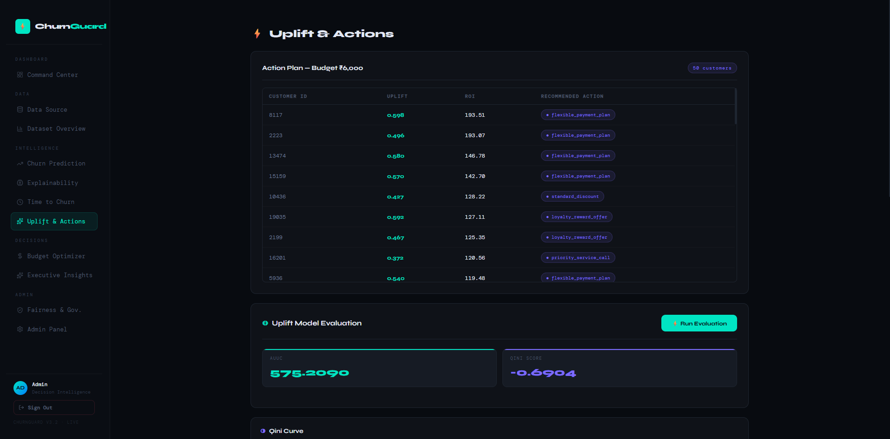
</p>
<p align="center"><em>Uplift Actions — per-customer uplift scoring and recommended interventions</em></p>

---

### API Services, Hooks, Utilities & State

| File | Role |
|---|---|
| `api.js` | Shared Axios instance (`baseURL: http://localhost:8000`). Used by all API modules. |
| `api/datasetApi.js` | Dataset summary, histograms, segments, drilldowns, SHAP, simulate, decisions, executive insights, command centre, and report download endpoints. |
| `api/insights.js` | Fetches latest insights from `GET /api/insights/latest`. |
| `api/simulate.js` | POSTs action simulation payload to `POST /explain/simulate`. |
| `api/ttcApi.js` | Calls `GET /timetochurn/summary/{filename}`. |
| `api/upliftApi.js` | Calls uplift vector, optimize, simple budget optimization, table, campaign allocation, uplift explain, LLM strategy, strategy compare, and file evaluation endpoints. |
| `store/datasetStore.js` | Zustand store persisting the currently selected dataset file path across all dashboard pages. |
| `store/drilldownStore.js` | Zustand store coordinating drilldown table open/close state and the currently selected segment value from chart clicks. |
| `utils/getFilename.js` | Extracts a base filename from a full file path string. Used to build API request parameters. |
| `utils/sampleCustomer.js` | Exports a sample customer object used for single-customer scoring demos and test payloads. |

> **Note:** No custom React hooks (`use*.js`) or React Context providers were discovered. Server state is managed by TanStack Query (configured in `main.jsx`); UI state is managed by Zustand stores.

---

## ⚡ Backend Architecture

### FastAPI Router Composition

```mermaid
flowchart TD
    App[app.py — FastAPI root] --> CORS[CORSMiddleware all origins]
    App --> DataR[data_router /data]
    App --> ModelR[model_router /model]
    App --> PredR[predict_router /predict]
    App --> ExplR[explain_router /explain]
    App --> SurvR[survival_router /survival]
    App --> UplR[uplift_router /uplift]
    App --> BudR[budget_router /budget]
    App --> DecR[decision_router /decision]
    App --> PrepR[prep_router /prep]
    App --> LlmR[llm_router /llm]
    App --> RepR[report_router /report]
    App --> GovR[governance /api/governance]
    App --> DsR[data_source_router]
    App --> DovR[dataset_overview_router /dataset]
    App --> SimR[simulator_router /simulate]
    App --> TtcR[timetochurn_router /timetochurn]
    App --> InsR[insights_router /insights]
    App --> DashR[dashboard_router /dashboard]
    App --> ApiDS[api.data_sources /api/data-source]
    App --> UplVal[uplift_policy_validation_api]
```

### Service Layer Summary

| Module Type | Files | Responsibility |
|---|---|---|
| **Routers / Controllers** | `backend/routers/*.py`, `backend/api/*.py` | HTTP boundary — request parsing, service invocation, response shaping. Never contain ML logic. |
| **Services** | `backend/services/*.py` | All business logic and ML workflows. Called exclusively by routers. |
| **Scoring** | `backend/scoring/*.py` | Scoring orchestration helpers bridging routers and services for churn, TTC, and uplift pipelines. |
| **Uplift Framework** | `backend/uplift/*.py` | Uplift meta-learner implementations, treatment encoding, evaluation, and validation. |
| **Insights** | `backend/insights/*.py` | Executive insight generation across nine analytical dimensions. |
| **Optimizer** | `backend/optimizer/*.py` | ROI calculation, greedy/knapsack budget allocation, and campaign distribution. |
| **Ingestion** | `backend/ingestion/` | Full data ingestion subsystem: readers, connectors, schema mapping, validation, processing, profiling, and registry. |
| **Schemas** | `backend/schemas/*.py` | Pydantic request/response models for dataset overview and governance APIs. |
| **Model Artifacts** | `backend/models/*.pkl` | Serialised churn, uplift, survival, preprocessing, and feature metadata objects. |
| **Middleware** | `CORSMiddleware` in `app.py` | Cross-origin request handling. **No authentication middleware present.** |
| **Utilities** | `file_utils.py`, `utils/governance_logger.py`, ingestion helpers | File, logging, and operational helpers. |

---

## 📡 API Documentation

**Base URL (local development):** `http://localhost:8000`

**Interactive Docs:** `http://localhost:8000/docs` (Swagger UI)

---

### Data & Data Sources

<p align="center">
  
</p>
<p align="center"><em>Data Source page — upload, synthetic generation, and external DB ingestion</em></p>

| Method | Endpoint | Description |
|---|---|---|
| `POST` | `/data/generate?n=5000` | Generate a synthetic raw dataset of `n` rows. |
| `POST` | `/data/upload` | Upload a CSV into `data/raw/`. |
| `GET` | `/data/profile/{filename}` | Profile a raw dataset (types, nulls, statistics). |
| `POST` | `/data/process/{filename}` | Clean and feature-engineer a raw dataset → `data/processed/`. |
| `GET` | `/data/preview/{filename}` | Preview first N rows of a processed file. |
| `POST` | `/data/upload-two-files` | Upload separate customer and churn CSV files, validate schema, merge, and store. |
| `POST` | `/data/synthetic` | Generate a synthetic uploaded dataset with realistic distributions. |
| `POST` | `/data/test-db` | Test a SQLite connection string. |
| `POST` | `/api/data-source/test` | Test configured external DB connection (Postgres/MySQL/MongoDB). |
| `POST` | `/api/data-source/ingest` | Ingest data from a DB query result. |
| `POST` | `/api/data-source/tables` | List available tables for an external data source. |
| `POST` | `/api/data-source/preview` | Preview rows from a selected table. |
| `POST` | `/ingest` | Upload a file and run the full ingestion pipeline. |

---

### Dataset Overview

<p align="center">
  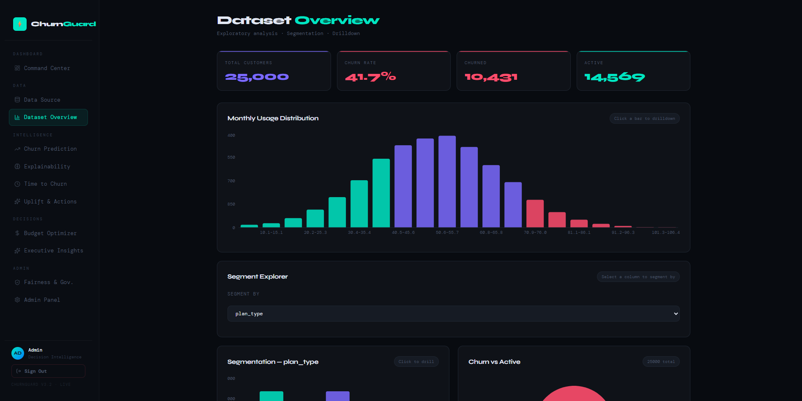
</p>
<p align="center"><em>Dataset Overview — summary cards, histograms, and segment analysis</em></p>

| Method | Endpoint | Description |
|---|---|---|
| `GET` | `/dataset/summary?path=...` | Row/column count, feature list, churn count, and churn rate. |
| `GET` | `/dataset/quality?path=...` | Missing values, duplicate rows, and invalid-range report. |
| `GET` | `/dataset/histogram?path=...&column=...&bins=20` | Numeric distribution histogram for a specified column. |
| `GET` | `/dataset/segments?path=...&column=...` | Category-level row counts for a categorical feature. |
| `GET` | `/dataset/drilldown/segment?path=...&column=...&value=...` | All rows matching a specific categorical segment. |
| `GET` | `/dataset/drilldown/range?path=...&column=...&low=...&high=...` | All rows within a numeric range. |
| `GET` | `/dataset/columns?path=...` | Dataset columns grouped by type for UI feature-selector use. |
| `GET` | `/dataset/numeric-bins?path=...&column=...&bins=5` | Numeric bin counts for a specified number of bins. |

---

### Modeling & Prediction

| Method | Endpoint | Description |
|---|---|---|
| `POST` | `/prep/train/{filename}` | Train and serialise the shared preprocessing pipeline artifact. |
| `POST` | `/model/train/{filename}` | Train a churn model on a processed file and save to `models/churn_model.pkl`. |
| `GET` | `/model/predict/{filename}` | Run batch prediction via model router. |
| `GET` | `/predict/file/{filename}` | Batch score a processed dataset; returns per-row predictions. |
| `POST` | `/predict/single` | Score a single customer JSON object; returns probability and binary prediction. |

---

### Explainability & Simulation

| Method | Endpoint | Description |
|---|---|---|
| `GET` | `/explain/test-id?customer_id=...` | Debug customer lookup for a hardcoded dataset. |
| `GET` | `/explain/file/{filename}?top_k=5&limit=50` | SHAP explanations for the top-risk customers in a file. |
| `POST` | `/explain/single?customer_id=...&top_k=3` | Explain one customer by ID; includes LLM narrative and action recommendation. |
| `GET` | `/explain/global/{filename}?limit=20` | Global feature importance for a processed file. |
| `GET` | `/explain/global?path=...&top_k=20` | Global feature importance via query-parameter path. |
| `POST` | `/explain/simulate` | Simulate a feature change for a customer and return delta churn probability. |
| `POST` | `/simulate/action` | Run action simulation via the strategy simulator router. |

---

### Survival, Time-to-Churn, Uplift, Decisions & Governance

<p align="center">
  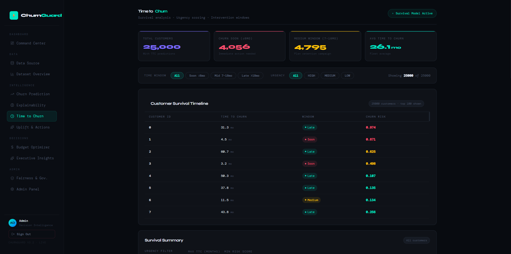
</p>
<p align="center"><em>Time to Churn — urgency scoring and customer ranking</em></p>

<p align="center">
  
</p>
<p align="center"><em>Time to Churn Map — visual urgency distribution</em></p>

| Method | Endpoint | Description |
|---|---|---|
| `POST` | `/survival/train/{filename}` | Train and serialise the survival model. |
| `GET` | `/survival/predict/{filename}?limit=50` | Predict time-risk scores per row. |
| `GET` | `/timetochurn/summary/{filename}` | Return TTC urgency summary and urgent customer list. |
| `POST` | `/uplift/train/{filename}` | Train the uplift model on a processed dataset. |
| `GET` | `/uplift/predict/{filename}?limit=50` | Predict per-action uplift scores per row. |
| `POST` | `/uplift/experiment/policy-compare/{filename}` | Compare multiple intervention policy strategies. |
| `POST` | `/uplift/eval/uplift` | Compute uplift evaluation metrics from a scored payload. |
| `POST` | `/uplift/eval/gain` | Compute gain curve metrics from a scored payload. |
| `POST` | `/uplift/optimize/simple` | Run simple budget optimisation over a set of uplift-scored rows. |
| `POST` | `/uplift/actions/table` | Build a structured table of uplift-based recommended actions. |
| `POST` | `/uplift/evaluate/{filename}` | Evaluate uplift model performance on a dataset. |
| `POST` | `/uplift/eval/deciles/{filename}` | Compute the decile lift table for a dataset. |
| `POST` | `/uplift/counterfactual` | Return counterfactual prediction for a customer+action combination. |
| `POST` | `/uplift/best-action` | Return the best action for a customer based on uplift scores. |
| `GET` | `/decision/plan/{filename}?budget=5000` | Build a budget-aware decision and action plan. |
| `GET` | `/decision/urgent/{filename}?budget=5000` | Return the most urgent customers and their recommended actions. |
| `GET` | `/budget/optimize/{filename}` | Run the full budget optimisation pipeline for a dataset. |
| `GET` | `/llm/decision_explain/{filename}` | LLM-generated explanation for the decision recommendations. |
| `GET` | `/report/executive/{filename}?budget=5000` | Generate and download the executive PDF report. |
| `GET` | `/insights/executive?dataset=...` | Generate full executive insights payload. |
| `GET` | `/insights/latest` | Retrieve the most recently cached insights result. |
| `GET` | `/dashboard/command-center?dataset=...` | KPIs and trend data for the executive command centre. |
| `POST` | `/api/governance/analyze` | Trigger governance analysis (drift, fairness, confidence) for a dataset. |
| `GET` | `/api/governance/report/{dataset_id}` | Retrieve the governance report for a dataset. |
| `GET` | `/api/governance/drift-status` | Get current drift status across all monitored datasets. |
| `GET` | `/api/governance/confidence-history/{dataset_id}` | Confidence score history over time for a dataset. |
| `GET` | `/api/governance/fairness-summary/{dataset_id}` | Fairness summary (demographic parity, equal opportunity) for a dataset. |

---

## 🗄️ Database Design

This platform primarily uses **file-based analytical storage** rather than an RDBMS. CSV, Parquet, JSON, PDF, and pickle files constitute the persistence layer.

| Entity | Storage Location | Key Fields / Contents | Relationship |
|---|---|---|---|
| **Customer Dataset** | `data/raw/*.csv`, `uploads/*.csv` | `customer_id`, demographic, billing, plan, usage features | Input source for the processing pipeline. |
| **Churn Labels** | `data/*churn*.csv`, uploaded churn file | `customer_id`, `churn` (0/1) | Joined to customer dataset on `customer_id`. |
| **Processed Dataset** | `data/processed/*.csv`, `*.parquet` | Engineered features + churn label | Consumed by model scoring, explainability, and insight services. |
| **Model Artifacts** | `models/*.pkl` | Serialised model/preprocessor/feature metadata | Loaded at inference time by `model_loader.py`. |
| **Scoring Results** | `data/scoring_results.json`, cache files | Per-customer predictions and derived metrics | Consumed by dashboards, insights, and decision engine. |
| **Governance Report** | `governance_logs/*.json` | Drift metrics, fairness metrics, confidence score, recommendations | Retrieved by `/api/governance/report/{dataset_id}`. |
| **Executive Report** | `reports/*.pdf` | ReportLab-generated multi-page PDF summary | Served as file download by `/report/executive/{filename}`. |
| **Dataset Registry** | `data/dataset_registry.json` | Dataset name, path, row count, ingest timestamp | Tracks all ingested datasets for UI listing. |

### Entity Relationship Diagram

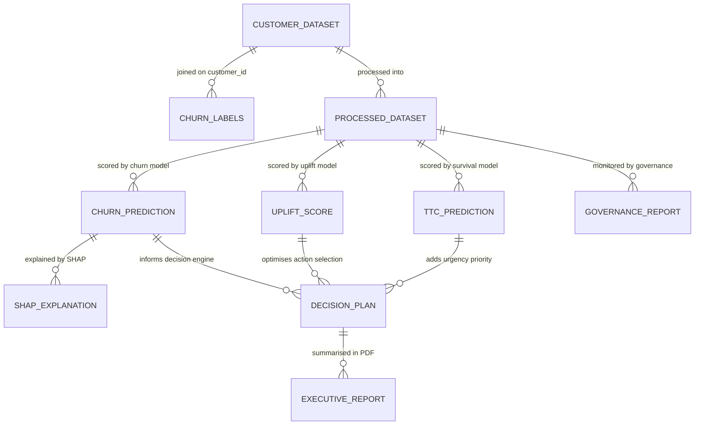

---

## 🔄 Request Flow

### Churn Prediction Flow

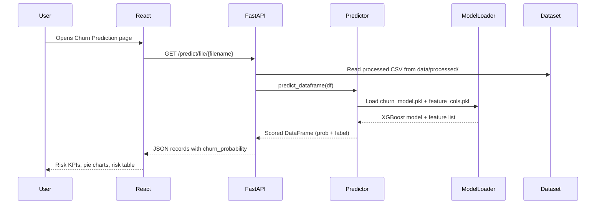

### SHAP Explainability Flow

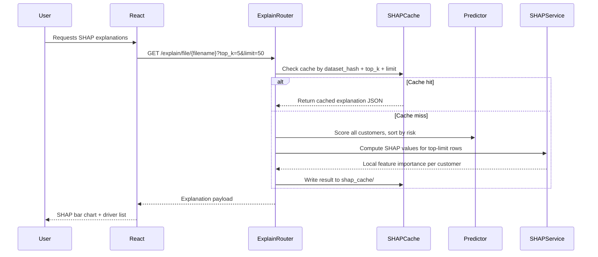

### Decision & Budget Optimisation Flow

<p align="center">
  
</p>
<p align="center"><em>Budget Optimizer — ROI-ranked, budget-constrained retention actions</em></p>

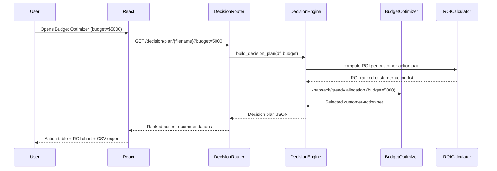

---

## 🔐 Authentication Flow

<p align="center">
  
</p>
<p align="center"><em>Login Page</em></p>

> **⚠️ Current State:** Authentication is frontend-only. `ProtectedRoute.jsx` gates `/dashboard/*` routes using local client state, but **no backend authentication middleware or JWT validation was discovered.** All API endpoints are currently open.

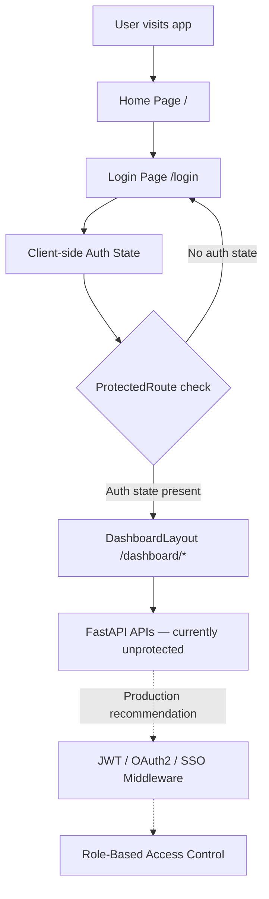

**Production Authentication Roadmap:**

| Step | Recommendation |
|---|---|
| Identity provider | OAuth2/OIDC (Okta, Auth0, Azure AD) or JWT-based custom auth. |
| Backend middleware | FastAPI `HTTPBearer` dependency injected into all protected routers. |
| RBAC | Separate roles for `analyst`, `executive`, and `admin` with endpoint-level permission checks. |
| Token storage | HttpOnly cookies preferred over `localStorage` for XSS protection. |
| Governance/reporting | Audit log entries should include authenticated user identity. |

---

## 📊 Data Flow

```mermaid
flowchart LR
    Upload[CSV Upload\nSynthetic Generation\nExternal DB Source]
    Raw[Raw Data\ndata/raw/ or uploads/]
    SchemaMap[Schema Mapping\ningestion/mapping/]
    Clean[Cleaning\ningestion/processing/cleaning.py]
    Encode[Encoding\ningestion/processing/encoding.py]
    Engineer[Feature Engineering\ningestion/processing/feature_engineering.py]
    Normalise[Normalisation\ningestion/processing/normalization.py]
    Processed[Processed Dataset\ndata/processed/]
    Churn[Churn Model\nmodels/churn_model.pkl]
    Survival[Survival Model\nmodels/survival_model.pkl]
    Uplift[Uplift Model\nmodels/uplift_model.pkl]
    Explain[SHAP + LLM Explainability\nservices/explainer.py + llm_explainer.py]
    Decision[Decision Engine\nservices/decision_engine.py]
    Budget[Budget Optimiser\noptimizer/]
    Insights[Executive Insights\ninsights/executive_engine.py]
    Governance[Drift / Fairness / Confidence\nservices/governance.py]
    Report[PDF Report\nservices/report_generator.py]
    Dashboard[React Dashboard\nchurn-dashboard/]

    Upload --> Raw
    Raw --> SchemaMap
    SchemaMap --> Clean
    Clean --> Encode
    Encode --> Engineer
    Engineer --> Normalise
    Normalise --> Processed
    Processed --> Churn
    Processed --> Survival
    Processed --> Uplift
    Processed --> Governance
    Churn --> Explain
    Churn --> Decision
    Survival --> Decision
    Uplift --> Decision
    Decision --> Budget
    Budget --> Insights
    Insights --> Report
    Insights --> Dashboard
    Governance --> Dashboard
    Explain --> Dashboard
```

---

## 🚀 Installation

### Prerequisites

| Requirement | Version |
|---|---|
| Python | 3.11+ recommended |
| Node.js | 20+ (required for Vite 7) |
| npm | 9+ |
| pip | Latest |
| Optional: PostgreSQL / MySQL / MongoDB drivers | For external DB ingestion |

---

### Model Artifacts

The following trained model files must exist in `backend/models/` before the prediction endpoints will function:

| File | Purpose |
|---|---|
| `churn_model.pkl` | Primary XGBoost churn classifier. |
| `churn_model_colab.pkl` | Alternate churn model (Colab-trained variant). |
| `feature_cols.pkl` | Serialised list of model feature column names. |
| `preprocess_pipeline.pkl` | Scikit-learn preprocessing pipeline (imputation, encoding, scaling). |
| `shared_prep.pkl` | Shared preprocessing object used by uplift and survival paths. |
| `survival_model.pkl` | Lifelines survival model for time-to-churn estimation. |
| `uplift_model.pkl` | Uplift meta-learner model artifact. |

To retrain models from scratch, run the training scripts or use the `/model/train/{filename}`, `/prep/train/{filename}`, `/survival/train/{filename}`, and `/uplift/train/{filename}` API endpoints.

---

### Backend Setup

```bash
# 1. Navigate to the backend directory
cd backend

# 2. Create a Python virtual environment
python -m venv venv

# 3. Activate the virtual environment
# Windows PowerShell:
.\venv\Scripts\Activate.ps1
# macOS / Linux:
source venv/bin/activate

# 4. Install dependencies
pip install -r requirements.txt
```

---

### Frontend Setup

```bash
# 1. Navigate to the frontend directory
cd churn-dashboard

# 2. Install npm dependencies
npm install
```

---

## 🔧 Environment Variables

| Variable | Required | Used By | Description |
|---|---|---|---|
| `GROQ_API_KEY` | ✅ Required for LLM features | `services/llm_explainer.py`, `insights/narrative_generator.py` | API key for Groq-hosted LLM explanations, action recommendations, and executive narrative generation. |

Create `backend/.env`:

```env
GROQ_API_KEY=your_groq_api_key_here
```

> ⚠️ **Security Warning:** The current repository contains a `.env` file. Rotate any exposed credentials immediately before production use. Never commit real secret values.

---

## 💻 Local Development

### Start the Backend

```bash
cd backend
uvicorn app:app --reload --host 0.0.0.0 --port 8000
```

| URL | Purpose |
|---|---|
| `http://localhost:8000` | Backend API root |
| `http://localhost:8000/docs` | Swagger UI (interactive API documentation) |
| `http://localhost:8000/openapi.json` | OpenAPI schema JSON |

---

### Start the Frontend

```bash
cd churn-dashboard
npm run dev
```

| URL | Purpose |
|---|---|
| `http://localhost:5173` | React development server |

> The frontend communicates with the backend at `http://localhost:8000`. Ensure the backend is running before loading the dashboard.

---

## 📦 Build Process

### Frontend Production Build

```bash
cd churn-dashboard
npm run build      # Vite bundles and optimises the SPA to churn-dashboard/dist/
npm run preview    # Locally preview the production build
```

### Backend Packaging

The backend is not currently packaged as a wheel or container. For production:

```bash
# Run with multiple workers behind a reverse proxy
uvicorn app:app --host 0.0.0.0 --port 8000 --workers 4
```

For containerised deployment, create a `Dockerfile` in `backend/`:

```dockerfile
FROM python:3.11-slim
WORKDIR /app
COPY requirements.txt .
RUN pip install --no-cache-dir -r requirements.txt
COPY . .
EXPOSE 8000
CMD ["uvicorn", "app:app", "--host", "0.0.0.0", "--port", "8000"]
```

---

## 🌐 Deployment

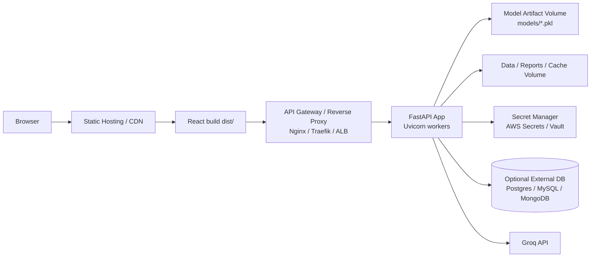

### Production Recommendations

| Area | Recommendation |
|---|---|
| **Frontend** | Serve `churn-dashboard/dist/` from a CDN or object storage (S3, Cloudflare Pages, Vercel). |
| **Backend** | Run FastAPI with 4+ Uvicorn workers behind Nginx, Traefik, or a cloud load balancer. |
| **Storage** | Replace local file storage with managed object storage (S3, GCS, Azure Blob) or durable volumes. |
| **Secrets** | Move `.env` values to a secret manager (AWS Secrets Manager, HashiCorp Vault, Azure Key Vault). |
| **CORS** | Disable wildcard `allow_origins=["*"]` and configure explicit allowed origins per environment. |
| **Authentication** | Add JWT/OAuth2 middleware before deploying any endpoint publicly. |
| **Models** | Store model metadata, training dataset hashes, and approval status in a database for auditability. |
| **Monitoring** | Add Prometheus metrics + Grafana dashboards for API latency, error rate, and model performance. |

---

## 🔒 Security

### Current State

| Area | Observation |
|---|---|
| **CORS** | Configured with `allow_origins=["*"]` and `allow_credentials=True`. This must be restricted in production. |
| **Authentication** | No backend authentication middleware was discovered. All API endpoints are open. |
| **Secrets** | `.env` file exists in the repository root and contains `GROQ_API_KEY`. **Rotate immediately.** |
| **File uploads** | CSV uploads are accepted without size limits, MIME checks, or malware scanning. |
| **Model loading** | `joblib`/`pickle` loading can execute arbitrary code; only load artifacts from trusted, signed sources. |
| **LLM prompts** | Customer data is sent to Groq's external API. Review data privacy requirements before deploying. |

### Recommended Controls

| Control | Description |
|---|---|
| **OAuth2 / OIDC / JWT** | Add server-side identity verification for all API requests. |
| **RBAC** | Define `analyst`, `executive`, and `admin` roles; enforce at the router level. |
| **Upload validation** | Enforce max file size, MIME type allowlist, and column-schema validation on all CSV uploads. |
| **Secret manager** | Never store secrets in environment files committed to source control. |
| **Audit logging** | Log model scoring events, report generation, governance runs, and user identity for compliance. |
| **Dependency scanning** | Run `pip-audit` and `npm audit` in CI to detect vulnerable packages. |
| **Model signing** | Checksum or cryptographically sign model artifacts to prevent tampering. |

---

## 🛡️ Error Handling

Backend routers use FastAPI's `HTTPException` for common error cases: missing files, invalid CSV schemas, bad database connections, and failed model loads. Many service paths use broad `except Exception` catches and return HTTP 500 or structured error payloads.

### Recommended Hardening

- Standardise all error responses to a common schema: `{ "error": "...", "detail": "...", "request_id": "..." }`.
- Avoid returning raw Python exception strings to API clients in production.
- Add request IDs and correlation IDs for distributed tracing.
- Separate user-safe error messages from internal diagnostics (log the full trace; return a safe summary).
- Add Pydantic validation schemas (`BaseModel` request bodies) for every POST endpoint to catch malformed input before service invocation.

---

## 📋 Logging

| Location | Current Behaviour |
|---|---|
| FastAPI / Uvicorn | Access logs printed to stdout during local development. |
| `ingestion/utils/logger.py` | Configures a named `ingestion` Python logger. |
| `utils/governance_logger.py` | Writes governance reports to timestamped JSON files in `governance_logs/`. |
| Service modules | Some modules use `print()` statements for debug output. |

### Production Recommendations

- Replace all `print()` debugging with structured `logging` calls at appropriate levels (`DEBUG`, `INFO`, `WARNING`, `ERROR`).
- Include `request_id`, `dataset_id`, `model_version`, and `user_id` in every log entry.
- Centralise logs in a log platform (Datadog, Elasticsearch/Kibana, CloudWatch).
- Add performance metrics: API endpoint latency, model load time, cache hit/miss rate, and SHAP computation duration.

---

## ⚡ Performance Optimisation

### Current Optimisations

| Optimisation | Location |
|---|---|
| SHAP explanation caching | `backend/shap_cache/` — keyed by dataset hash + limit + top-K |
| TTC summary caching | `backend/ttc_cache/` — keyed by dataset hash |
| Insights caching | `backend/cache/insights/` — keyed by dataset hash |
| Lazy model loading | `services/model_loader.py` — loads artifacts once per process |
| React Query caching | Frontend — caches API responses and de-duplicates concurrent requests |

### Recommended Improvements

- **Avoid redundant CSV loads:** Cache loaded DataFrames in-process (e.g., `functools.lru_cache` keyed on file path + mtime) rather than re-reading on every request.
- **Pagination:** Add `offset` + `limit` parameters to large prediction and decision plan endpoints.
- **Background jobs:** Move SHAP computation, PDF report generation, uplift evaluation, and governance runs to background tasks (FastAPI `BackgroundTasks` or Celery).
- **Model artifact versioning:** Version and checksum model files; reload only when the checksum changes.
- **Pre-computed aggregates:** Materialise dashboard KPIs immediately after ingestion/scoring rather than computing them on demand.
- **Response compression:** Enable gzip compression at the reverse proxy layer.
- **Parquet over CSV:** Prefer Parquet for intermediate processed datasets — faster reads, smaller footprint, schema preservation.

---

## 🧪 Testing

### Discovered Test Files

| File | Purpose |
|---|---|
| `backend/test.py` | Backend local/smoke test helper. |
| `backend/test_pipeline.py` | Validates the ingestion pipeline end-to-end. |
| `backend/uplift_smoke.py` | Smoke validation for the uplift model and scoring path. |

### Available Commands

```bash
# Frontend linting
cd churn-dashboard
npm run lint

# Backend tests (after adding a formal pytest suite)
cd backend
pytest

# Backend tests with coverage
cd backend
pytest --cov=. --cov-report=html
```

### Recommended Coverage Areas

| Area | Test Type |
|---|---|
| FastAPI router contracts | Integration tests — assert status codes, response schema, and edge cases for all endpoints. |
| Dataset validation & schema mapping | Unit tests — valid schema, missing columns, type mismatches. |
| Prediction consistency | Regression tests — score a fixed fixture dataset; assert output matches a known baseline. |
| Governance drift / fairness / confidence | Unit tests — inject synthetic drift; assert correct flag and metric values. |
| Frontend route rendering | React Testing Library — assert each page renders without errors. |
| Frontend API error states | Mock Axios responses; assert error banners and empty-state UIs. |
| End-to-end flow | Playwright / Cypress — upload → process → predict → explain → decision → report. |

---

## 🔮 Future Improvements

| Priority | Improvement |
|---|---|
| 🔴 High | Add backend authentication (JWT / OAuth2 / OIDC) and role-based access control. |
| 🔴 High | Replace file-based runtime state with a durable database (PostgreSQL) and object storage (S3). |
| 🔴 High | Add Dockerfiles and `docker-compose.yml` for one-command reproducible deployment. |
| 🔴 High | Implement CI/CD pipeline (GitHub Actions) for linting, tests, dependency scanning, and build artefacts. |
| 🟡 Medium | Add explicit model registry with versions, training dataset hashes, evaluation metrics, and approval status. |
| 🟡 Medium | Align `upliftApi.js` frontend API wrappers with discovered FastAPI router definitions. |
| 🟡 Medium | Add OpenAPI examples and Pydantic request schemas for every POST endpoint. |
| 🟡 Medium | Add streaming / background job support for long-running SHAP, report, and governance runs. |
| 🟢 Low | Add monitoring dashboards for API latency, cache hit rate, model drift, and model performance. |
| 🟢 Low | Add data privacy controls for LLM prompts (PII redaction before sending to Groq). |
| 🟢 Low | Wire inactive pages (`CampaignPlanner`, `ExperimentPage`, `RetentionDashboard`, etc.) into `App.jsx` routes. |

---

## 🤝 Contributing

1. **Fork** the repository and create a descriptive feature branch (`feature/add-jwt-auth`).
2. Keep **frontend and backend changes separated** where possible for clean, reviewable PRs.
3. **Add or update tests** for any changed behaviour.
4. Run **frontend linting** (`npm run lint`) and **backend smoke tests** before committing.
5. **Document** new endpoints, pages, environment variables, and model artifacts in this README.
6. Submit a **pull request** with screenshots or API response examples for all user-facing changes.
7. For breaking changes, update the deployment and environment variable sections accordingly.

---

## 📄 License

> **No license file was discovered in this repository.**

Add a `LICENSE` file before distributing, publishing, or using this project in a commercial environment. Recommended options:

| License | Use Case |
|---|---|
| MIT | Permissive — open source, commercial use allowed. |
| Apache 2.0 | Permissive with patent protection. |
| GPL-3.0 | Copyleft — derivative works must also be open source. |
| Proprietary | Closed source / internal enterprise use only. |

---

## 👤 Author

> Author information was not explicitly found in the repository metadata scanned for this README.

Add project owner, team, organisation, and contact details here.

```
Name:         <Your Name / Team Name>
Organisation: <Company / University>
Contact:      <Email / LinkedIn>
GitHub:       <https://github.com/your-profile>
```

---

## 🙏 Acknowledgements

This project is built on top of world-class open-source technology:

| Library | Role |
|---|---|
| [React](https://react.dev/) | Frontend UI framework |
| [Vite](https://vitejs.dev/) | Frontend build tooling |
| [FastAPI](https://fastapi.tiangolo.com/) | Backend API framework |
| [Pandas](https://pandas.pydata.org/) | Data manipulation |
| [NumPy](https://numpy.org/) | Numerical computing |
| [Scikit-learn](https://scikit-learn.org/) | ML pipelines and evaluation |
| [XGBoost](https://xgboost.readthedocs.io/) | Gradient boosting models |
| [SHAP](https://shap.readthedocs.io/) | Model explainability |
| [Lifelines](https://lifelines.readthedocs.io/) | Survival analysis |
| [Recharts](https://recharts.org/) | React charting library |
| [Zustand](https://zustand-demo.pmnd.rs/) | Frontend state management |
| [TanStack Query](https://tanstack.com/query/) | Server-state management |
| [ReportLab](https://www.reportlab.com/) | PDF generation |
| [Groq](https://groq.com/) | LLM inference API |
| [River](https://riverml.xyz/) | Online drift detection |

---

## 🏁 Conclusion

This repository is a comprehensive **prototype-to-enterprise foundation** for churn decision intelligence. It already contains the major building blocks of a production retention platform:

- ✅ **Data ingestion** from multiple source types
- ✅ **Churn, survival, and uplift modelling** with persisted artifacts
- ✅ **SHAP + LLM explainability** with caching
- ✅ **Budget-aware decision engine** with knapsack optimisation
- ✅ **Governance monitoring** (drift, fairness, confidence)
- ✅ **Executive PDF reporting**
- ✅ **Rich React dashboard** with 20+ pages and 40+ components

The highest-priority production work is to **secure the API** (add JWT/OIDC authentication), **externalise secrets and storage** (secret manager + object storage), **formalise the test suite** (pytest + Playwright), **add deployment automation** (Docker + CI/CD), and **align the frontend API wrappers** with the backend route definitions.

With those foundations in place, this platform is ready to serve as a live, enterprise-grade churn retention intelligence system.

---

<div align="center">

**Built with ❤️ using React, FastAPI, XGBoost, SHAP, and Groq**

</div>
